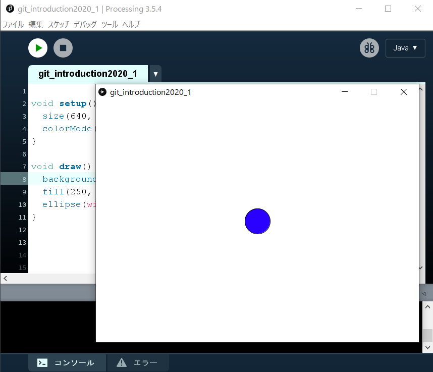

# Git Introduction 1 in 2020 Spring \~Gitコマンドの確認\~

ブランチを各自できって, なんでも良いので動作する Processing のコードと
合わせて README を編集して push しましょう！

### 名前

なりた えいふ

### 手順

1. このリポジトリを git clone しましょう
2. 自分の名前を入れたブランチを master からきってチェックアウトしましょう

3. Processing で `git_introduction2020_1.pde` を編集して, 実行画面のスクショを READMEに追加してください

3. `README.md` の名前を自分の名前に変更しましょう！

4. 変更した差分をコミット & プッシュをして, GitHubでプルリクエストを投げましょう！
